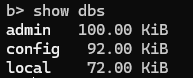

# MongoDB Query Study

```properties
# ℹ️ Docker를 사용해서 실행함
#   - Mongo Compass GUI Tool을 활용하여 확인
```

## Set-Up
### MongoDB 이미지 다운로드
`docker pull mongo`

### Container 생성
```shell
docker run -d --name mongodb -v C:\Users\edel1\Desktop\docker-volume\mongo:/data/db -e MONGO_INITDB_ROOT_USERNAME=root -e MONGO_INITDB_ROOT_PASSWORD=123 -p 27017:27017 mongo
```
- 정상 동작 확인 방법 아래 링크 클릭 시 확인 가능함
    - `http://localhost:{지정 포트번호}`

### Mongo DB 접속
- 컨테이너 접근
    - `docker exec -it {{containerName}} /bin/bash`
- MongoDB 접속
    - `mongosh -u root -p`

## Database

### Database 목록 확인
- `show dbs`
    - 해당 명려어 사용시 미리 만들어진 3개의 Database를 확인 할 수 있음
    -
    

    - 각각의 설명
        - admin
            - 관리용 데이터베이스 (권한 및 클러스터 설정). 루트 데이터베이스로 사용
            - 시스템 수준의 관리 작업(사용자 관리, 권한 설정 등)은 대부분 admin 데이터베이스에서 이루어짐
            - 사용자 인증
                - 사용자가 admin 데이터베이스에서 인증되면, MongoDB 인스턴스 전체에 대한 권한을 가질 수 있음
                - 예) root 역할을 가진 사용자를 admin 데이터베이스에 추가하면, 이 사용자는 **모든 데이터베이스를 관리**할 수 있음
            - 클러스터 관리
                - 복제본 세트(replica set), 샤드 클러스터(sharded cluster) 관리와 같은 고급 작업도 admin 데이터베이스에서 설정
            - 서버 정보 저장
                - 일부 시스템 정보와 서버 상태가 admin 데이터베이스에 저장됩니다.
        - local
            - 서버별 데이터베이스.
            - 복제본 세트 설정 및 복제되지 않는 데이터를 저장.
        - config:
            - 샤드 클러스터 환경에서 메타데이터를 저장.

### Database 생성
- `use {생성하고 싶은 데이터 베이스명}`
    - 존재하지 않는 Database를 선택해도 **에러가 나지 않음**
        - 데이터베이스 "암시적 생성" 상태이기 때문임 MongoDB는 Collection을 추가 시 진짜 Database가 생성된다.
    - "데이터베이스를 생성한다"기보다는 "선택한다"는 의미함.

### Database 삭제
> 삭제할 Database 이동
- `db.dropDatabase();'

### Database 확인
- 현재 Database 확인
    - `db`
- 내가 만든 Database List 확인
    - `show dbs`

<hr/>

## 계정

### Role 종류

| 역할 (Role)      | 설명                                                          |
|-------------------|---------------------------------------------------------------|
| `read`           | 지정된 데이터베이스에 대한 읽기 권한                          |
| `readWrite`      | 지정된 데이터베이스에 대한 읽기 및 쓰기 권한                  |
| `dbAdmin`        | 데이터베이스 관리 권한 (인덱스 관리, 통계 조회 등)            |
| `userAdmin`      | 사용자 관리 권한                                              |
| `clusterAdmin`   | 클러스터 관리 권한                                           |
| `root`           | 모든 권한 (슈퍼유저)                                         |


### 계정 생성
- admin Database 선택
    - `use admin`
- 계정 생성
    - **"db"가 "admin"** 이기에 **모든 Database에 권한**을 갖는다
  ```javascript
  db.createUser(
  {
    user: "yoo",
    pwd:  "123",
    roles: [
    	{ "role" : "root", "db" : "admin" },
	]
  }
  ```

### 계정 삭제
> 삭제할 대상이 있는 Database 선택
- `db.dropUser("{{삭제 대상 ID}}");`

### 계정 정보 수정
> 변경할 대상이 있는 Database 선택
- ```javascript
  db.updateUser("{{대상 ID}}", {
    pwd: "{{변경할 PW}}", // 변경할 비밀번호 - optional
    roles: [ { role: "{{지정 권한}}", db: "<database_name>" } ] // 변경할 권한 - optional
  });
  ```


### 계정 목록 확인
- `db.getUsers()`

<hr/>

## Collection (Table)

### Collection 생성
- 명령어 : `db.createCollection(name, [options]) `
- 기본 생성
    - `db.createCollection("생성할 Collectio명")`
- 옵션 추가 생성
    - 옵션 종류
        -  capped :  true 로 설정 시 **고정된 크기(fixed size)를 가진 Collection으로 만들어짐**
            -  size 가 초과되면 **가장 오래된 데이터를 덮어 씌움**
                - true로 설정하면 size 값을 꼭 설정해야 함
            - autoIndexId : true로 설정하면, _id 필드에 **index를 자동으로 생성** (Default : false)
            - size :  Capped collection 사용 시 컬렉션의 최대 사이즈(maximum size)를 ~ bytes로 지정
                - max :  COllection에 **추가 할 수 있는 최대 갯수를 설정**
    -  ```javascript
    	   db.createCollection("articles", {
		capped: true,
		autoIndex: true,
		size: 6142800,
		max: 10000
           })
	   ```

### Collection 삭제
- 명령어 : `db.Collection명.drop() `

## Document (Row - 데이터)

### Document 추가(Insert)
```properties
# ℹ️ Document Insert 시 자동으로 _id가 증가되는것을 확인 있다.
#    - 해당 값은 값을 각각의 Document를 식별하기 위한 PK이며 필수값이다.
#      ㄴ _Id를 지정 주입 가능하나 중복된 값은 불가능   
#          ㄴ db.users.insertOne({{ "_id": "Hi_Im_yoo", "name": "Alice", })
```
- 명령어 : `db.COLLECTION_NAME.insertOne(document)` , `db.COLLECTION_NAME.insertMany(document)`

    - Ex)  `db.foo.insertOne({"name": "유정호", "age": 120})` ,  `db.foo.insertMany([ {"name": "감", "age": 20}, {"name": "사과", "age": 30} ])`

### Document 조회
```properties
# ℹ️ pretty()를 뒤에 붙이면 보기 좋게 정리 되어 나옴
#   ㄴ> Ex) db.COLLECTION_NAME.find([OPTIONS]).pretty()가능하다
```
- 기본 조회 명령어
    - 전체 조회  `db.COLLECTION_NAME.find([OPTIONS])` 
        - EX)
            -  `db.foo.find();` :  전체 조회 
    - 단건 조회  `db.COLLECTION_NAME.findOne([OPTIONS]) ` 

### projection Option
```properties
# ℹ️ find({ where 옵션 }, {  조회 필드 옵션 }) 메소드의 두번째 parameter를 의미한다.
#    ㄴ 쿼리의 결과값에서 보여질 field를 정함
#    ㄴ 보여줄 필드를 true, false로 지정
#       ㄴ ⭐️ ture를 사용하면 ture만 설정하자 혼잡 적용 X
```
- 조회 예시
    - 필드 명이 "article03"인 조회 목록에서 title을 제외한 나머지를 조회
        - `db.book.find({ title: "article03" }, { title : false }  );`
    -  name이 "yoo" 이고 age랑 name을 제외
    - `db.book.find({ name: "yoo" }, { age: 0, name: 0 });`
        - 0 : 숨김 , 1 : 보여짐 >> 🤯 0, 1 혼합 사용 불가능
##### $slice 연산자
- $slice 연산자는 Document **배열의 limit 설정** 조회
- 예시
  - title 값이 article03 인 데이터의 댓글(comments)은 하나만 보이게 출력
    - `db.book.find( { title: "article03" }, { comments: { $slice: 1 } } )`

#### 비교(Comparison) 연산자

| 연산자   | 설명                           | 부등호 표현     | 사용 예시                                         |
|----------|--------------------------------|-----------------|--------------------------------------------------|
| `$eq`    | 주어진 값과 일치하는 값        | `=`             | `{ age: { $eq: 25 } }` (age가 25인 문서 찾기)     |
 | `$ne`    | 주어진 값과 일치하지 않는 값    | `!=`            | `{ age: { $ne: 25 } }` (age가 25가 아닌 문서 찾기)|
| `$gt`    | 주어진 값보다 큰 값            | `>`             | `{ age: { $gt: 25 } }` (age가 25보다 큰 문서 찾기)|
| `$gte`   | 주어진 값보다 크거나 같은 값    | `>=`            | `{ age: { $gte: 25 } }` (age가 25 이상인 문서 찾기)|
| `$lt`    | 주어진 값보다 작은 값          | `<`             | `{ age: { $lt: 25 } }` (age가 25보다 작은 문서 찾기)|
| `$lte`   | 주어진 값보다 작거나 같은 값    | `<=`            | `{ age: { $lte: 25 } }` (age가 25 이하인 문서 찾기)|
| `$in`    | 주어진 배열 안에 속하는 값      | 값 리스트 포함  | `{ age: { $in: [20, 25, 30] } }` (20, 25, 30 중 하나 찾기)|
| `$nin`   | 주어진 배열 안에 속하지 않는 값 | 값 리스트 제외  | `{ age: { $nin: [20, 25, 30] } }` (20, 25, 30 제외)|

- 조회 예시
  - likes 30 초과 40 미만: `db.book.find({likes : {$gt : 30, $lt : 40}})`
  - IN 조회  "Aplpha","Bravo" 가 들어있는 : `db.book.find({ writer: { $in: ["Alpha", "Bravo"] } });`

#### 논리(Logical) 연산자

| 연산자   | 설명                                      |
|----------|-------------------------------------------|
| `$or`    | **주어진 조건 중 하나라도** 참이면 참입니다. |
| `$and`   | **주어진 모든 조건이** 참이면 참입니다.     |
| `$not`   | **주어진 조건이** 거짓이면 참입니다.        |
| `$nor`   | **주어진 모든 조건이** 거짓이면 참입니다.   | 

- 조회 예시
    - title 값이 “article01” 이거나, writer 값이 “Alpha” 인 Document 조회
      - `db.book.find({ $or : [ {title : "article01"}, {writer : "Alpha"} ] })` 
    - writer 값이 “Velopert” 이고 likes 값이 10 미만인 Document 조회
      - `db.book.find({ $and : [ {likes : {$lt : 10}}, {writer : "Velopert"} ] })`

#### $regex 연산자
```properties
# ℹ️ $regex 연산자를 통해 Document를 정규식을 통해 찾을 수 있다.
#   ㄴ> ✏️ like 검색
# { <field>: { $regex: /pattern/, $options: '<options>' } }
# { <field>: { $regex: 'pattern', $options: '<options>' } }
# { <field>: { $regex: /pattern/<options> } }
# { <field>: /pattern/<options> }
```
- 옵션 종류
  | **옵션** | **설명**                                                                 |
  |----------|--------------------------------------------------------------------------|
  | `i`      | 대소문자 무시                                                            |
  | `m`      | 정규식에서 anchor(`^`, `$`)를 사용할 때 값에 `\n`이 있으면 무력화          |
  | `x`      | 정규식 안에 있는 whitespace를 모두 무시                                   |
  | `s`      | dot(`.`) 사용 시 `\n`을 포함해서 매치                                    |

- 조회 예시
  - 적성자에 가운데 "pha"가 포함된 데이터
    -  `db.book.find({ writer : { $regex : /pha/ }   })`
  - 적성자에 가운데 "pha"가 포함된 데이터 대소문자 구분 X, trim 적용
    -  `db.book.find({ writer: { $regex: /pha/, $options: "ix" } })`
    - 내장형으로 변경
      -  `db.book.find({ writer: { $regex: /pha/ix } })`

#### $elemMatch 연산자
```properties
# ℹ️ 배열 내 포함하는 내용이 있을 경우 조회
```
- 조회 예시
  - comments(배열) 중 name이 “Charlie” 있는 데이터
    - `db.book.find({ comments : {  $elemMatch : {  name : "Charlie"}  } })`

#### $exists 연산자
```properties
# ℹ️ 해당 key 자체가 존재 하는지 안 하는지 boolean 값을 통해 조회 가능
#    ㄴ> null 을 찾으려면  `{$eq : null}` 혹은 `<field>: null`을 사용
```
- 조회 예시
  - comments 데이터가 존재하지 않는 경우
    - `db.book.find({ comments: { $exists: false } })`

#### $size 연산자
```properties
# ℹ️ 배열의 크기를 확인
```
- 조회 예시
  - comments(배열)의 크키가 1인 데이터
      - `db.book.find({ comments: { $size: 1 } })`


#### 정렬 연산자
```properties
# ℹ️ cursor.sort( DOCUMENT )를 사용해서 정렬이 가능하다.
#   ㄴ> 1 일 경우 오름 차순 // -1 일 경우 내림 차순
```
- 조회 예시
  - id 기준 내림 차순 정렬
    - `db.orders.find().sort( {_id : -1})`
  - 가격, _Id만 보이게  가격 기준 오름 차순 정렬
    - `db.orders.find({},{ amount : true }).sort( { amount : 1})`

#### 개수 제한 연산자
```properties
# ℹ️ cursor.limit( value )을 사용해서 출력할 데이터 갯수를 제한할 때 사용됩니다.
#    ㄴ value 파라미터는 출력 할 갯수 값 입니다.
```
- 조회 예시
  - 3개만 보이게 조회
    - `db.orders.find().limit(3)`

#### skip 연산자
```properties
# ℹ️ cursor.skip( value )을 사용해서 출력 할 데이터의 시작부분을 설정할 때 사용됩니다.
#    ㄴ value 값 갯수의 데이터를 생략하고 그 다음부터 출력합니다.
```
- 조회 예시
  - 5개의 데이터를 제외 후 조회
    - `db.orders.find().skip(5)`

#### 응용 (페이징) - limit, skip 활용
- 조회 예시
  - `orders` 컬렉션에서 `_id`를 기준으로 내림차순 정렬한 후, 특정 페이지의 데이터를 가져오는 쿼리
      - ```javascript
        db.orders.find()                            // 전체 데이터 조회
            .sort( { "_id": -1 } )                  // 내림차순 정렬
            .skip( (page - 1) * 10 )                // 페이지 스킵 (1페이지당 10개)
            .limit(10);                             // 최대 10개 조회
        ```

### Document 삭제
- 명령어
  - 단건 삭제 : `db.COLLECTION_NAME.deleteOne( 조건값 )`
    - Ex) `db.book.deleteOne({name : "유정호"})`
  - 여러개  삭제 : `db.COLLECTION_NAME.deleteOne( 조건값 )`
    - Ex) `db.book.deleteMany({name : "유정호"})`
  - Document  전체 삭제
    - Ex) `db.book.deleteMany({})`


### Document 업데이트
```properties
# ℹ️  db.COLLECTION.updateOne( { 조건 }  , $set : { 변경 값 } ), updateMany()를 사용해서 Document의 특정 값을 변경 가능
#    ㄴ 특정 필드 값만 변경 $set 명령어 사용
#    ㄴ 특정 필드 제거 $unset 명령어 사용
#
# ℹ️  db.COLLECTION.replaceOne( 조건 , 변경 값 ), replaceMany()를 사용해서 Document 값 자체를 변경 가능
#
# Sample Data
# [
#   { name: "Abet", age: 19 },
#   { name: "Betty", age: 20 },
#   { name: "Charlie", age: 23, skills: [ "mongodb", "nodejs"] },
#   { name: "David", age: 23, score: 20 }
# ]
```

#### 특정 field 업데이트 하기
- 예시
  - 단건 특정 **필드 업데이트**
    - "Abet"의 age를 "45"살로 변경
      - ```javascript
        db.people.updateOne(
          { name: "Abet" },              // 조건
          { $set: { age: 45 } }          // 업데이트 내용
          )
        ```
    - "Abet"의 age를 "20"살로 변경 하고 종교 필드를 추가
      - ```javascript
        db.people.updateOne(
            { name: "Abet" },                      // 조건
            { $set: { age: 20, religion: "none" } } // 업데이트 내용
        )    
        ```
  - 찾는 Document 가 없을 경우 **자동 추가**
    - "Elly" 데이터를 변경 **없을 경우 추가**
      - ```javascript
        db.people.updateOne(
          { name: "Elly" },                    // 조건
          { $set: { name: "Elly", age: 17 } }, // 업데이트 내용
          { upsert: true }                     // 옵션
        )
        ```
  - 단건 특정 **필드 제거**
      - "Abet"의 `age` 필드를 제거
        - ```javascript
          db.people.updateOne(
            { name: "Abet" },              // 조건
            { $unset: { age: true } }      // 필드 제거
          )
          ```
  - 단건 **replace**
      - "Betty" 문서를 **이름을 "yoo"**, **나이를 "100"살**, **취미를 "coding"**으로 변경
        - ```javascript
          db.people.updateOne(
            { name: "Betty" },                             // 조건
            { name: "yoo", age: 100, hobby: ["coding"] }   // 새 문서 (replace)
          )
          ```
  - 특정 조건에 맞는 여러 데이터 **필드 업데이트**
    - age가 20 보다 낮거나 같은 document의 score를 9999로 설정
        - ```javascript
          db.people.updateMany(
            { age: { $lte: 20 } },            // 조건
            { $set: { score: 9999 } }         // 업데이트 내용
          )
          ```
           
#### 배열 값 추가
```properties
# ℹ️ $push 명령어를 통해 배열 내 값을 추가
#     ㄴ ✨ 중복을 방지하고 싶다면 $addToSet 사용
#
#   해당 명령어도 updateOne, updateMany를 구분해서 사용하면 단건 or 다건 업데이트 가능
```
- 예시
  - (중복 허용) name이 "Charlie"인 데이터에 skills에 "nextjs"를 추가
    - ```javascript
      db.people.updateOne( 
        { name: "Charlie" },             // "name"이 "Charlie"인 문서 찾기
        {
          $push: { skills: "nextJs" }    // "skills" 배열에 "nextJs" 값 추가 (중복되지 않으면 추가)
         }
      );
      ```
  - (중복 X) name이 "Charlie"인 데이터에 skills에 "nextjs"를 추가
      - ```javascript
      db.people.updateOne( 
        { name: "Charlie" },                 // "name"이 "Charlie"인 문서 찾기
        {
          $addToSet: { skills: "nextJs" }    // "skills" 배열에 "nextJs" 값 추가 (중복되지 않으면 추가)
         }
      );
      ```

#### 배열 여러 개의 값 추가
```proplerties
# ℹ️ $push 명령어만을 사용하면 해당 배열 내 한건의 데이터만 추가가 가능하다
#   ㄴ $push 명령어와 $each 명령어를 함께 사용하면 배열에 하나 이상의 데이터를 추가 할 수 있다. 
#      ㄴ 해당 명령어 또한 중복을 제거 해서 추가하라면 $addToSet를 사용
```
- 예시
  - "Charlie" 의 skills에 "c++" 와 "java" 를 추가
    - ```javascript
      db.people.updateOne(
        { name : "Charlie" }              // 대상 지정
        , { $push : {
              skills : {                  // set 필드 지정
                  $each : ["c++", "java"] // $each를 사용해 하나 이상을 추가
               }
        } }
      )
      ```